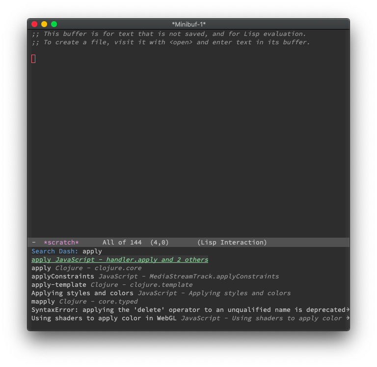

# DashDoc

Search DashDoc within Emacs.

# Usage

You can search using `query` or `keyword:query` The `keyword` can be a [docset keyword](https://kapeli.com/dash_guide#docsetKeywords) or a [search profile keyword](https://kapeli.com/dash_guide#searchProfiles), for example: `php:query`.

# Requirements

- [Dash](https://kapeli.com/dash)
- [Alfred](https://www.alfredapp.com/)
- [Dash Alfred Workflow](https://github.com/Kapeli/Dash-Alfred-Workflow)
